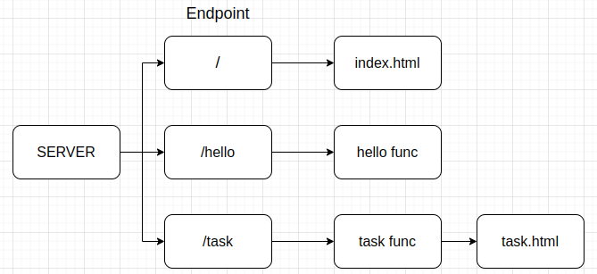

# Go Web Server Project

This is a simple Go web server project that includes three endpoints:

1. `/`: Displays the `index.html` file.
2. `/hello`: Executes the `hello` function.
3. `/task`: Contains the `task` function and uses `task.html` to input tasks.

## Endpoints

### 1. `/`

-   Method: GET
-   Description: Displays the `index.html` file.

### 2. `/hello`

-   Method: GET
-   Description: Executes the `hello` function.

### 3. `/task`

-   Method: GET
-   Description: Contains the `task` function.
-   Additional File: `task.html` - Use this file to input tasks.

## How to Run

1. Clone the repository:

    ```bash
    git clone https://github.com/mananispiwpiw/web-server.git
    cd web-server
    ```

## System Design


